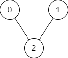
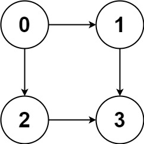
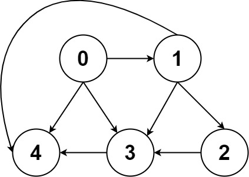

# SolvingCodingProblems

# Problem 1. On an infinite plane, a robot initially stands at (0, 0) and faces north. The robot can receive one of three instructions:

  "G": go straight 1 unit;
  "L": turn 90 degrees to the left;
  "R": turn 90 degrees to the right.
  The robot performs the instructions given in order, and repeats them forever.
  
  Return true if and only if there exists a circle in the plane such that the robot never leaves the circle.
  
      Example 1:

      Input: instructions = "GGLLGG"
      Output: true
      Explanation: The robot moves from (0,0) to (0,2), turns 180 degrees, and then returns to (0,0).
      When repeating these instructions, the robot remains in the circle of radius 2 centered at the origin.
      
      Example 2:

      Input: instructions = "GG"
      Output: false
      Explanation: The robot moves north indefinitely.
      
      Example 3:

      Input: instructions = "GL"
      Output: true
      Explanation: The robot moves from (0, 0) -> (0, 1) -> (-1, 1) -> (-1, 0) -> (0, 0) -> ...
  
  # Problem 2. Given an array of integers nums and an integer target, return indices of the two numbers such that they add up to target.

    You may assume that each input would have exactly one solution, and you may not use the same element twice.
    You can return the answer in any order.
    
    Example 1:

      Input: nums = [2,7,11,15], target = 9
      Output: [0,1]
      Explanation: Because nums[0] + nums[1] == 9, we return [0, 1].
    
    Example 2:

      Input: nums = [3,2,4], target = 6
      Output: [1,2]
    
    Example 3:

      Input: nums = [3,3], target = 6
      Output: [0,1]

# Problem 3. Addition of two list nodes,
Inout - [2,4,3], [5,6,4]
Output - [7,0,8]

# Problem 4. Given a string s, find the length of the longest substring without repeating characters.

Example 1:

Input: s = "abcabcbb"
Output: 3
Explanation: The answer is "abc", with the length of 3.
Example 2:

Input: s = "bbbbb"
Output: 1
Explanation: The answer is "b", with the length of 1.
Example 3:

Input: s = "pwwkew"
Output: 3
Explanation: The answer is "wke", with the length of 3.
Notice that the answer must be a substring, "pwke" is a subsequence and not a substring.

# Problem 5. Median of two sorted arrays.

Example 1:

Input: nums1 = [1,3], nums2 = [2]
Output: 2.00000
Explanation: merged array = [1,2,3] and median is 2.
Example 2:

Input: nums1 = [1,2], nums2 = [3,4]
Output: 2.50000
Explanation: merged array = [1,2,3,4] and median is (2 + 3) / 2 = 2.5.

Constraints:

nums1.length == m
nums2.length == n
0 <= m <= 1000
0 <= n <= 1000
1 <= m + n <= 2000
-106 <= nums1[i], nums2[i] <= 106

# Problem 6.  Longest Palindromic Substring.

Given a string s, return the longest palindromic substring in s.

Example 1:

Input: s = "babad"
Output: "bab"
Explanation: "aba" is also a valid answer.
Example 2:

Input: s = "cbbd"
Output: "bb"

# Problem 7.  Zigzag Conversion.

Example 1:

Input: s = "PAYPALISHIRING", numRows = 3
Output: "PAHNAPLSIIGYIR"
Example 2:

Input: s = "PAYPALISHIRING", numRows = 4
Output: "PINALSIGYAHRPI"
Explanation:
P     I    N
A   L S  I G
Y A   H R
P     I
Example 3:

Input: s = "A", numRows = 1
Output: "A"

# Problem 8.  Reverse Integer.

Given a signed 32-bit integer x, return x with its digits reversed. If reversing x causes the value to go outside the signed 32-bit integer range [-231, 231 - 1], then return 0.

Assume the environment does not allow you to store 64-bit integers (signed or unsigned).

Example 1:

Input: x = 123
Output: 321
Example 2:

Input: x = -123
Output: -321
Example 3:

Input: x = 120
Output: 21

Constraints:

-231 <= x <= 231 - 1

# Problem 9.  Palindrome number

Given an integer x, return true if x is palindrome integer.

An integer is a palindrome when it reads the same backward as forward.

For example, 121 is a palindrome while 123 is not.

Example 1:

Input: x = 121
Output: true
Explanation: 121 reads as 121 from left to right and from right to left.
Example 2:

Input: x = -121
Output: false
Explanation: From left to right, it reads -121. From right to left, it becomes 121-. Therefore it is not a palindrome.
Example 3:

Input: x = 10
Output: false
Explanation: Reads 01 from right to left. Therefore it is not a palindrome.

# Problem 10.  Container with most water

You are given an integer array height of length n. There are n vertical lines drawn such that the two endpoints of the ith line are (i, 0) and (i, height[i]).

Find two lines that together with the x-axis form a container, such that the container contains the most water.

Return the maximum amount of water a container can store.

Notice that you may not slant the container.

Example 1.

Input: height = [1,8,6,2,5,4,8,3,7]
Output: 49
Explanation: The above vertical lines are represented by array [1,8,6,2,5,4,8,3,7]. In this case, the max area of water (blue section) the container can contain is 49.

Example 2:

Input: height = [1,1]
Output: 1

# Problem 10.  Container with most water

Roman numerals are represented by seven different symbols: I, V, X, L, C, D and M.

Symbol       Value
I             1
V             5
X             10
L             50
C             100
D             500
M             1000
For example, 2 is written as II in Roman numeral, just two one's added together. 12 is written as XII, which is simply X + II. The number 27 is written as XXVII, which is XX + V + II.

Example 1:

Input: s = "III"
Output: 3
Explanation: III = 3.
Example 2:

Input: s = "LVIII"
Output: 58
Explanation: L = 50, V= 5, III = 3.
Example 3:

Input: s = "MCMXCIV"
Output: 1994
Explanation: M = 1000, CM = 900, XC = 90 and IV = 4.

# Problem 11.  Find smallest positive interger in an Array

Write a function:

class Solution { public int solution(int[] A); }

that, given an array A of N integers, returns the smallest positive integer (greater than 0) that does not occur in A.

For example, given A = [1, 3, 6, 4, 1, 2], the function should return 5.

Given A = [1, 2, 3], the function should return 4.

Given A = [−1, −3], the function should return 1.

Write an efficient algorithm for the following assumptions:

N is an integer within the range [1..100,000];
each element of array A is an integer within the range [−1,000,000..1,000,000].

# Problem 12.  Find if path exist in current graph by DFS (Depth First Search)

Case - 1

Input: n = 3, edges = [[0,1],[1,2],[2,0]], source = 0, destination = 2
Output: true
Explanation: There are two paths from vertex 0 to vertex 2:
- 0 → 1 → 2
- 0 → 2

Case - 2 

Input: n = 6, edges = [[0,1],[0,2],[3,5],[5,4],[4,3]], source = 0, destination = 5
Output: false
Explanation: There is no path from vertex 0 to vertex 5.

# Problem 13.  Find all the paths exist in current graph by DFS (Depth First Search)

Case - 1

Input: graph = [[1,2],[3],[3],[]]
Output: [[0,1,3],[0,2,3]]
Explanation: There are two paths: 0 -> 1 -> 3 and 0 -> 2 -> 3.

Case - 2

Input: graph = [[4,3,1],[3,2,4],[3],[4],[]]
Output: [[0,4],[0,3,4],[0,1,3,4],[0,1,2,3,4],[0,1,4]]

# Problem 14.  Find No of islands DFS (Depth First Search)

Example 1:

Input: grid = [
["1","1","1","1","0"],     
["1","1","0","1","0"],
["1","1","0","0","0"],
["0","0","0","0","0"]
]

Output: 1

Example 2:

Input: grid = [
["1","1","0","0","0"],
["1","1","0","0","0"],
["0","0","1","0","0"],
["0","0","0","1","1"]
]

Output: 3

# Problem 15.  Manipulate String on the basis of given two string with certain conditions

Example 1:

String A = "Pqrst", String B = "psrqz"

Output: PqRs-

Example 2:

String A = "AbCdu", String B = "zcadu"

Output: a-cDU

# Problem 16.  String to Integer (ATOI)

Example 1:

Input: s = "42"
Output: 42
Explanation: The underlined characters are what is read in, the caret is the current reader position.
Step 1: "42" (no characters read because there is no leading whitespace)
^
Step 2: "42" (no characters read because there is neither a '-' nor '+')
^
Step 3: "42" ("42" is read in)
^
The parsed integer is 42.
Since 42 is in the range [-231, 231 - 1], the final result is 42.

Example 2:

Input: s = "   -42"
Output: -42
Explanation:
Step 1: "   -42" (leading whitespace is read and ignored)
^
Step 2: "   -42" ('-' is read, so the result should be negative)
^
Step 3: "   -42" ("42" is read in)
^
The parsed integer is -42.
Since -42 is in the range [-231, 231 - 1], the final result is -42.

Example 3:

Input: s = "4193 with words"
Output: 4193
Explanation:
Step 1: "4193 with words" (no characters read because there is no leading whitespace)
^
Step 2: "4193 with words" (no characters read because there is neither a '-' nor '+')
^
Step 3: "4193 with words" ("4193" is read in; reading stops because the next character is a non-digit)
^
The parsed integer is 4193.
Since 4193 is in the range [-231, 231 - 1], the final result is 4193.

# Problem 17.  Time to type a String on special keyboad

Input: keyboard = "abcdefghijklmnopqrstuvwxyz", text = "cba"
Output: 4
Explanation:
Initially your finger is at index 0. First you have to type 'c'. The time taken to type 'c' will be abs(2 - 0) = 2 because character 'c' is at index 2.
The second character is 'b' and your finger is now at index 2. The time taken to type 'b' will be abs(1 - 2) = 1 because character 'b' is at index 1.
The third character is 'a' and your finger is now at index 1. The time taken to type 'a' will be abs(0 - 1) = 1 because character 'a' is at index 0.
The total time will therefore be 2 + 1 + 1 = 4.